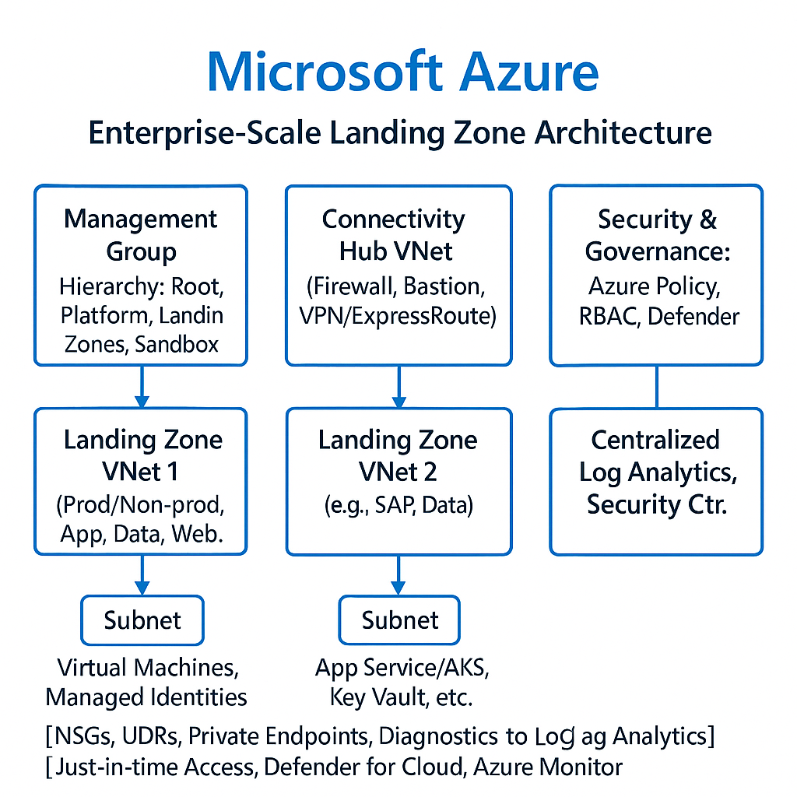

 [](LICENSE.md)

---

> **💡 Quick Overview**
>
> This repo delivers an **Enterprise-Scale Azure Landing Zone** with built-in governance, plus a **DevTest Lab** setup for secure VM-based smart contract development and **Full CI/CD** for Solidity contracts via GitHub Actions.

---

## 📖 Table of Contents

1. [About](#about)
2. [Key Features](#key-features)
3. [Architecture](#architecture)
4. [Prerequisites](#prerequisites)
5. [Getting Started](#getting-started)
6. [Repo Layout](#repo-layout)
7. [Deploy Landing Zone](#deploy-landing-zone)
8. [Provision DevTest Lab](#provision-devtest-lab)
9. [Smart Contract Workflow](#smart-contract-workflow)
10. [CI/CD Pipelines](#ci-cd-pipelines)
11. [Contributing](#contributing)
12. [License & Support](#license--support)

---

## 🎯 About

A turnkey foundation combining Azure best practices with a hardened DevTest Lab environment, plus a developer-friendly pipeline for writing, testing, and deploying Solidity contracts.

---

## ✨ Key Features

|         Domain | Technology                      | Highlights                                  |
| -------------: | ------------------------------- | ------------------------------------------- |
|      **Infra** | Bicep, Azure CLI                | Modular templates, **RBAC**, NSGs, JIT      |
| **Governance** | Azure Policy, Management Groups | Security baselines, cost controls           |
|    **DevTest** | DevTest Labs, ARM/Bicep         | Secure VMs, artifacts, auto-shutdown        |
| **Blockchain** | Hardhat, Mocha/Chai             | Local testing, coverage reports             |
|      **CI/CD** | GitHub Actions                  | Multi-stage pipelines for infra & contracts |

---

## 🏗 Architecture



> A high-level workflow showing how Bicep modules, DevTest Lab, and GitHub Actions integrate for end-to-end automation.

---

## 🔧 Prerequisites

* **Azure Subscription** (Owner)
* **Azure CLI** ≥ 2.40.0
* **Bicep CLI**
* **Node.js** ≥ 16.x & **npm**
* **GitHub PAT** with `repo` & `workflow` scopes

---

## 🚀 Getting Started

<details>
<summary>1. Clone Repository</summary>

```bash
git clone https://github.com/YourOrg/YourRepo.git
cd YourRepo
```

</details>

<details>
<summary>2. Azure Login & Subscription</summary>

```bash
az login
az account set --subscription <SUBSCRIPTION_ID>
```

</details>

<details>
<summary>3. Deploy Landing Zone</summary>

```bash
az deployment sub create \
  --location eastus \
  --template-file bicep/landing-zone.bicep \
  --parameters @bicep/parameters/landing-zone-parameters.json
```

</details>

<details>
<summary>4. Provision DevTest Lab VM</summary>

```bash
az deployment group create \
  --resource-group DevTestLabRG \
  --template-file devtest-lab/devtest-lab.bicep \
  --parameters @devtest-lab/parameters/devtest-vm.parameters.json
```

</details>

<details>
<summary>5. Smart Contract Dev & Test</summary>

```bash
cd smart-contracts
npm install
npx hardhat compile
npx hardhat test
```

</details>

<details>
<summary>6. Manual Deploy Contracts</summary>

```bash
npx hardhat run scripts/deploy.js --network <network>
```

</details>

---

## 📂 Repo Layout

```text
├── .github/workflows/      # GitHub Actions
├── bicep/                  # Landing Zone modules
├── devtest-lab/            # DevTest Lab templates & scripts
├── smart-contracts/        # Solidity, tests, configs
├── docs/                   # Additional guides
├── diagrams/               # Visio/PNG architecture diagrams
├── scripts/                # Automation & helper scripts
├── wiki/                   # Markdown stubs for GitHub Wiki
├── LICENSE.md
└── README.md
```

---

## ⚙️ Deploy Landing Zone

Deep dive into Bicep modules, parameterization, and security controls in \[wiki/landing-zone-overview\.md].

---

## 🖥 Provision DevTest Lab

Secure VM provisioning, artifact management, and auto-shutdown strategies in \[wiki/devtest-lab-security.md].

---

## 📜 Smart Contract Workflow

Hardhat setup, test strategy, and deployment steps documented in \[wiki/smart-contracts-ci-cd.md].

---

## 🔄 CI/CD Pipelines

Multi-stage GitHub Actions: infra (landing-zone-ci.yml) & blockchain (hardhat-ci.yml). Full docs in \[wiki/ci-cd-overview\.md].

---

## 🤝 Contributing

We love contributions! Please ensure you:

1. Fork the repo
2. Follow **conventional commits**
3. Run & pass existing tests
4. Submit a PR with clear description

See \[CODE\_OF\_CONDUCT.md] for guidelines.

---

## 📜 License & Support

Licensed under MIT. Open an issue or contact @YourGitHubHandle for help.

---

# 📚 GitHub Wiki Structure

Below are the primary wiki pages; each has an intro stub in `/wiki`:

* **Home** (`Home.md`): Project elevator pitch & navigation
* **Landing Zone Overview** (`landing-zone-overview.md`)
* **Programmatic Deployment** (`programmatic-deployment.md`)
* **DevTest Lab Security** (`devtest-lab-security.md`)
* **Smart Contracts CI/CD** (`smart-contracts-ci-cd.md`)
* **CI/CD Overview** (`ci-cd-overview.md`)
* **Troubleshooting** (`troubleshooting.md`)
* **FAQ** (`faq.md`)


